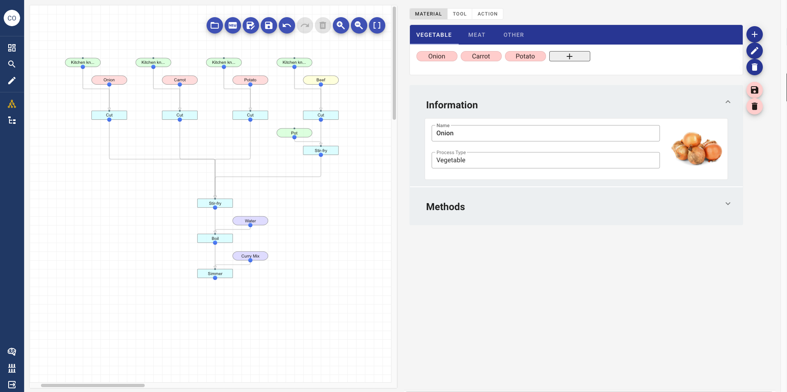

# Labmine-dev
Labmine is an electronic lab notebook focusing on process.
It can be used for research, manufacture, cooking, hobbies, etc.


## Demo 
https://demo-labmine.c1.hacobuneapp.com/

## How to use
After preparing the environment to run docker, run the following.
```sh
# recursive cloning of the labmine-dev repository
git clone --recursive https://github.com/kumagallium/labmine-dev.git

# move to working directory
cd labmine-dev

# build on the local computer
docker-compose up --build
```
Go to "http://localhost:3000" in your browser and check that Labmine is running.
Please modify the environment variables as necessary.

## Contributing
1. Fork it (`git clone https://github.com/kumagallium/labmine-dev.git`)
2. Create your feature branch (`git checkout -b your-new-feature`)
3. Commit your changes (`git commit -am 'feat: add some feature'`)
4. Push to the branch (`git push origin your-new-feature`)
5. Create a new Pull Request

## License
Labmine is developed and maintained by Masaya Kumagai, under [MIT License](LICENSE).